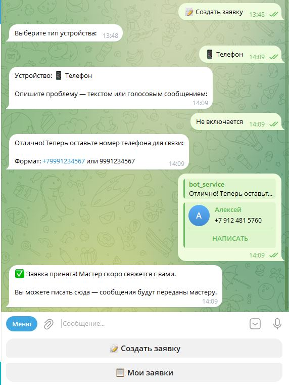
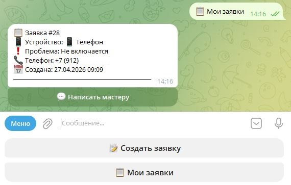
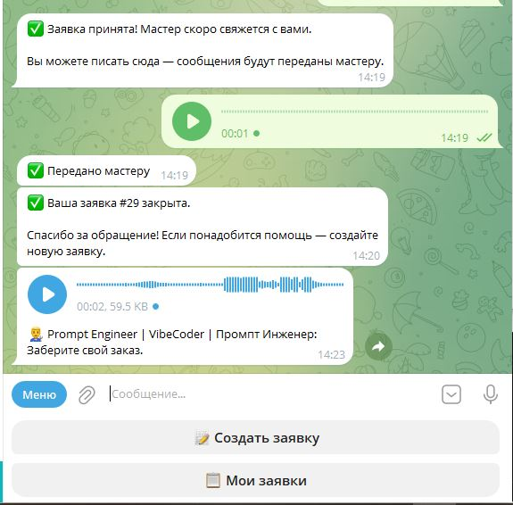
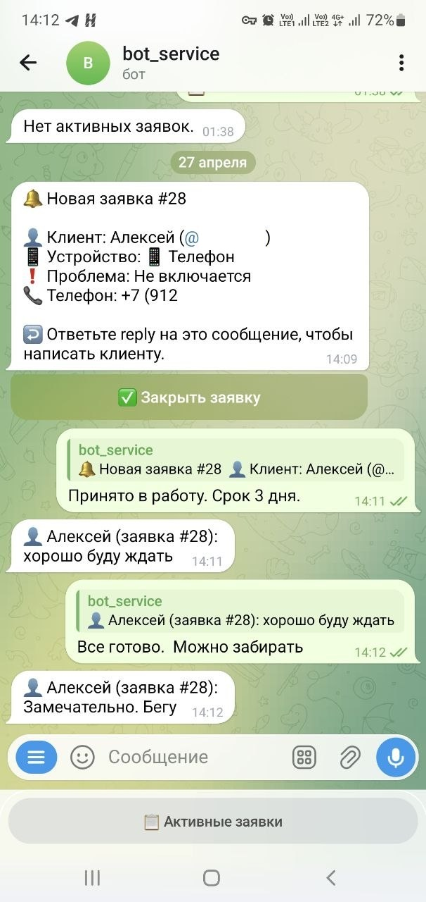
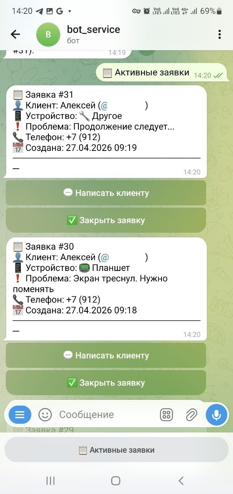

<div align="center">

# 🔧 RepairBot

**Telegram-бот для приёма заявок на ремонт техники**

Клиент пишет — мастер отвечает. Без звонков, без лишних шагов.

[](https://python.org)
[](https://aiogram.dev)
[](https://postgresql.org)
[](https://redis.io)
[](https://docker.com)

[**→ Написать и заказать бота**](https://t.me/YOUR_CONTACT)

</div>

---

## Что это

Готовый бот для сервисного центра или частного мастера по ремонту техники. Клиент создаёт заявку в пару шагов, мастер получает уведомление и сразу выходит на связь — всё внутри Telegram, без сторонних приложений.

---

## Как работает

### Для клиента — 3 шага до заявки

<div align="center">

&nbsp;&nbsp;&nbsp;

&nbsp;&nbsp;&nbsp;

</div>

<br/>

1. **Выбрать устройство** — ноутбук, телефон, планшет, компьютер, часы, наушники
2. **Описать проблему** — текстом или голосовым (бот сам расшифрует)
3. **Оставить номер телефона** — и ждать ответа мастера

После создания заявки — прямой чат с мастером прямо в боте.

---

### Для мастера — всё в одном месте

<div align="center">

&nbsp;&nbsp;&nbsp;&nbsp;

</div>

<br/>

- 🔔 Мгновенные уведомления о новых заявках с полными данными клиента
- 💬 Ответить клиенту — просто reply на уведомление
- 📋 Список всех активных заявок одной кнопкой
- ✅ Закрытие заявки с уведомлением клиента

---

## Ключевые возможности

| Возможность | Описание |
|---|---|
| 🎙 **Голосовые сообщения** | Автоматическая транскрипция через Groq Whisper — клиент говорит, текст появляется у мастера |
| 💬 **Чат-мост** | Двусторонняя переписка через бота — без обмена номерами |
| 🛡 **Защита от спама** | Rate limiting на все действия: заявки, команды, сообщения |
| 🔁 **Дедупликация** | Одинаковые заявки за 10 минут автоматически блокируются |
| 📦 **Статусы заявок** | `new` → `in_progress` → `completed` |

---

## Устройства

```
💻 Ноутбук    📱 Телефон    📲 Планшет
🖥 Компьютер  ⌚️ Часы       🎧 Наушники
```

---

## Стек

```
Python 3.12 + aiogram 3.x     — Telegram Bot API
PostgreSQL 15                  — заявки и данные клиентов
Redis 7                        — FSM, сессии, rate limiting
Groq Whisper API               — транскрипция голосовых
Docker + docker-compose        — деплой за 5 минут
```

---

## Настройка лимитов

Все параметры защиты от спама настраиваются через `.env`:

```env
RATE_LIMIT_START_MAX=3          # попыток /start в минуту
RATE_LIMIT_REQUEST_MAX=3        # заявок за 5 минут
RATE_LIMIT_RELAY_MAX=10         # сообщений мастеру в минуту
DUPLICATE_CHECK_WINDOW=600      # окно проверки дублей (сек)
```

---

## Безопасность

- Данные клиентов хранятся только в вашей БД PostgreSQL
- Номера телефонов не передаются третьим лицам
- Голосовые сообщения не сохраняются на сторонних серверах
- Rate limiting защищает от флуда и злоупотреблений

---

<div align="center">

## Хотите такого бота?

Настрою и запущу под ваш сервисный центр или мастерскую.

**[→ Написать в Telegram](https://t.me/YOUR_CONTACT)**

</div>
